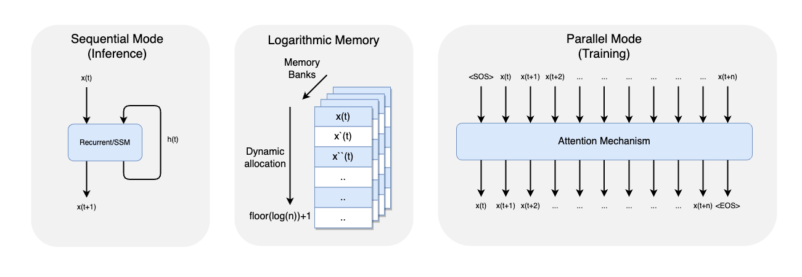
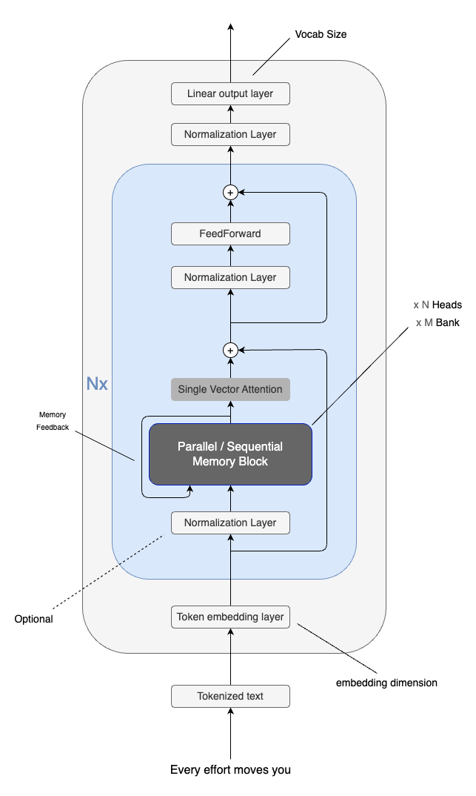
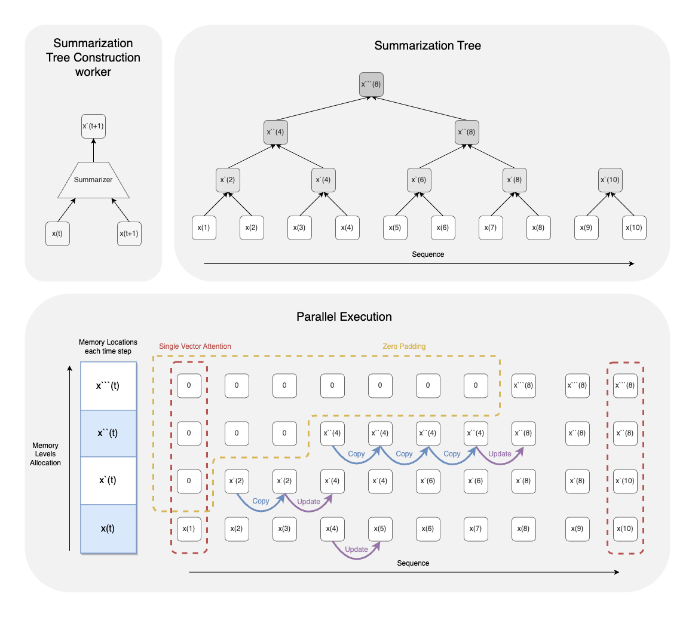
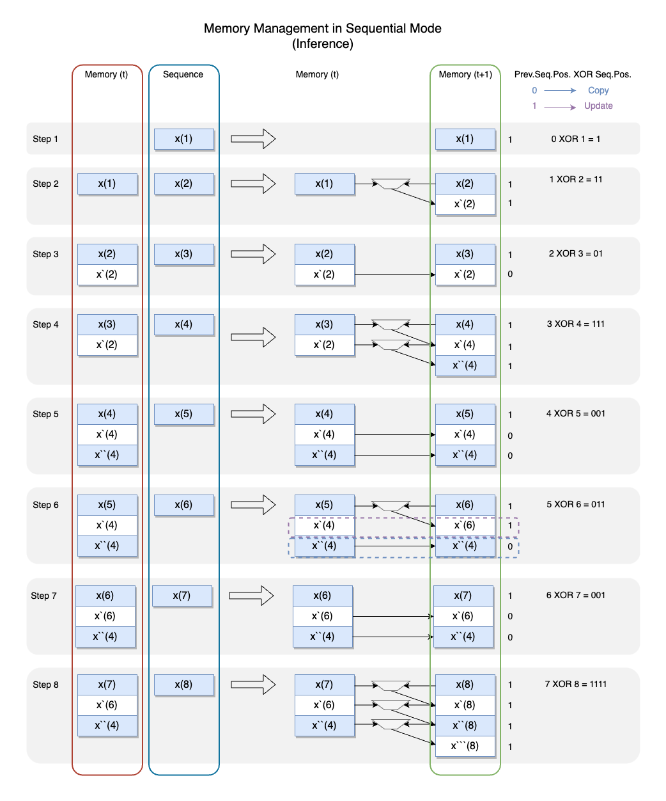
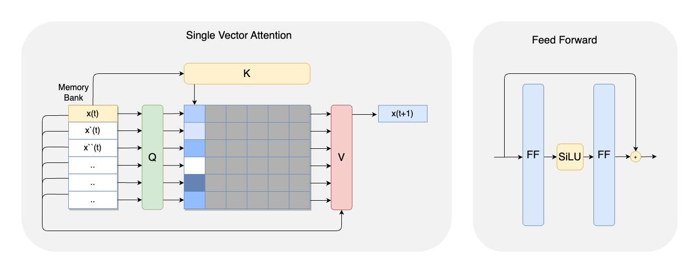
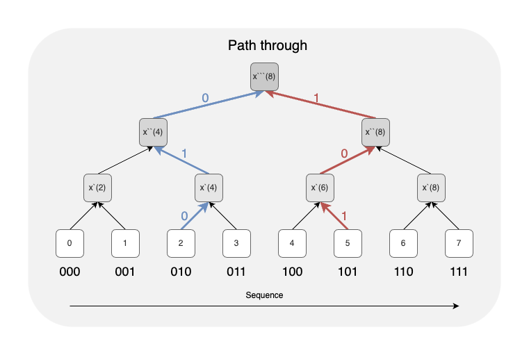
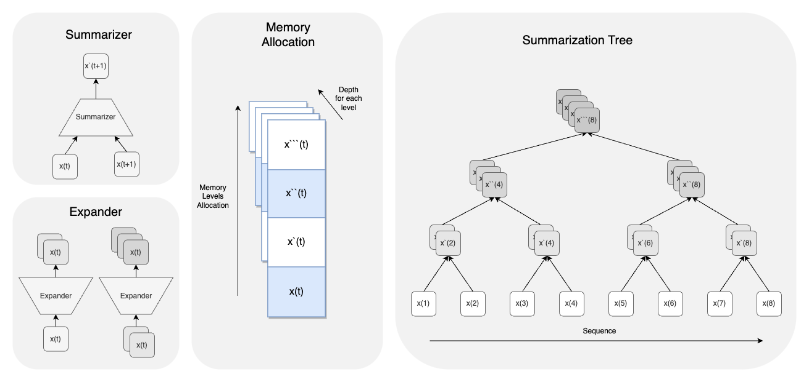

# Logarithmic Memory Networks (LMNs)

Logarithmic Memory Networks (LMNs) offer a novel approach to long-range sequence modeling, addressing challenges in computational and memory efficiency faced by traditional architectures such as Transformers and Recurrent Neural Networks (RNNs). This repository provides the implementation of LMNs and demonstrates their performance on sequence modeling tasks.

---

## 📖 Introduction

LMNs leverage a hierarchical logarithmic tree structure to efficiently store and retrieve historical information. This architecture employs:
- **Parallel execution mode** during training for efficient processing.
- **Sequential execution mode** during inference for reduced memory usage.

LMNs also eliminate the need for explicit positional encoding by implicitly encoding positional information. This results in a robust and scalable architecture for sequence modeling tasks with lower computational costs.

<p align="center">
  
</p>

---

## 🛠️ Architecture Overview

The LMN architecture introduces a **summarization layer** that builds a logarithmic tree to manage memory effectively. This enables efficient access to long-term dependencies with reduced complexity. The model also employs a **single-vector targeted attention mechanism** for precise retrieval of stored information.

<p align="center">
  
</p>

---

### 🔄 Tree Construction and Parallel Execution

During training (parallel mode), the summarization layer builds the logarithmic memory tree efficiently. This parallel execution speeds up processing and ensures that the hierarchical structure is properly optimized.

<p align="center">
  
</p>

---

### 🧠 Memory Management and Sequential Execution

In inference (sequential mode), LMNs dynamically summarize memory, reducing the memory footprint significantly. This mode processes sequences step-by-step, making it ideal for memory-constrained devices.

<p align="center">
  
</p>

---

### 🎯 Single-Vector Attention

The LMN employs a **single-vector attention mechanism**, which efficiently retrieves relevant information from memory without the need for computationally expensive multi-vector attention operations.

<p align="center">
  
</p>

---

### 📍 Relative Positional

The hierarchical tree encodes each token’s relative position as a path or binary representation during parallel or sequential summarization

<p align="center">
  
</p>

---

### ↔️ Expander Summarizer

The Expander Summarizer Architecture uses hierarchical memory and an expander layer with 1D transposed convolution to improve long-sequence processing. It achieves scalability with a complexity of  O(k/2 \cdot \log^2(n))  while retaining critical information efficiently.

<p align="center">
  
</p>

---

## 📂 Repository Contents

- **`./Source`**: Contains the core implementation of the LMN architecture.
- **`./Notebook`**: A Jupyter notebook that demonstrates the use of LMNs on sequence modeling tasks.
- **`./Figures`**: visualizations used in this repository and the accompanying paper.

---

## 🚀 Usage

1. Clone this repository:
   ```bash
   git clone https://github.com/AhmedBoin/LogarithmicMemory.git
   cd LogarithmicMemory
   ```

2.	Explore the test_notebook.ipynb notebook to test and visualize LMN performance.

📜 License

This repository is licensed under the MIT License. See the LICENSE file for details.

✍️ Citation

If you use this repository in your research or find it helpful, please cite our work as:

```bibtex
@article{Taha2025LogMem,
  author    = {Mohamed A. Taha},
  title     = {Logarithmic Memory Networks (LMNs)},
  journal   = {To Be Published},
  year      = {2025},
}
```

📬 Contact

For questions, collaborations, or feedback, feel free to reach out:

•	📧 Gmail: [ahmed.boin@gmail.com]
 
•	💼 LinkedIn: [https://www.linkedin.com/in/ahmed-boin/]
 
•	🐦 Twitter: [https://x.com/AhmedBoin]


Happy coding! 😊
